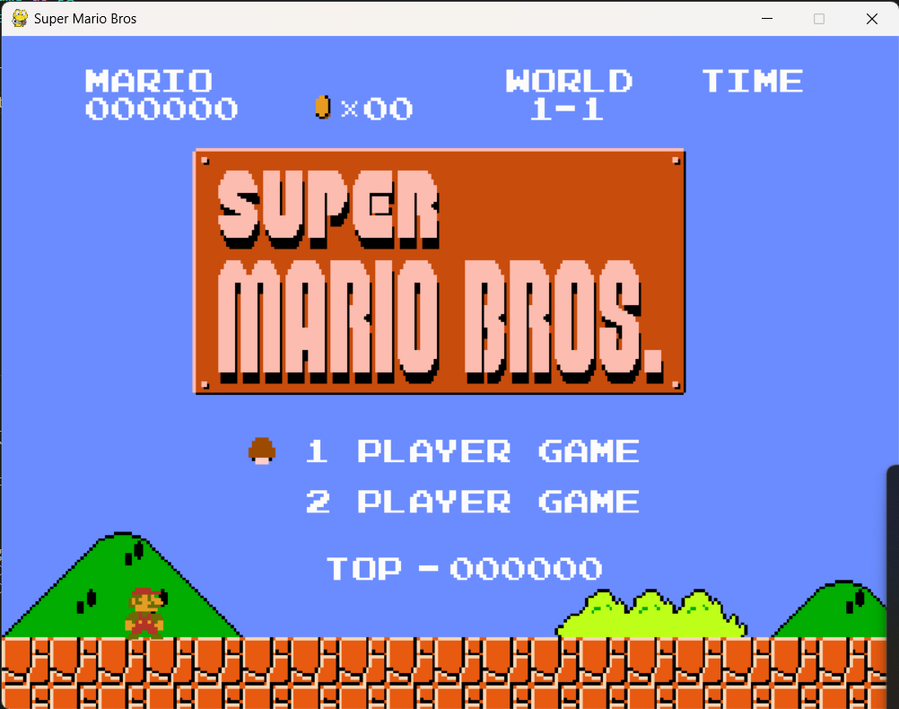
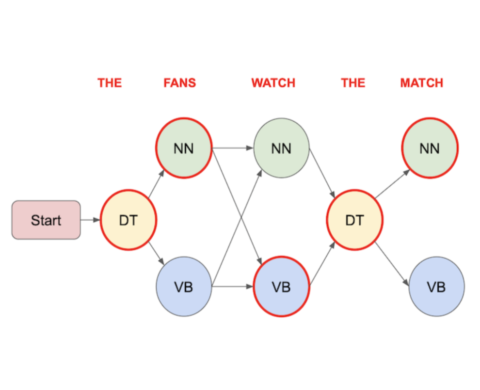
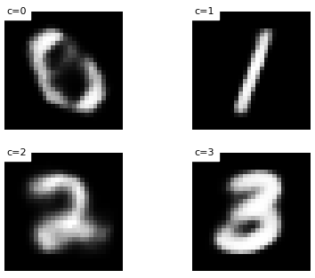
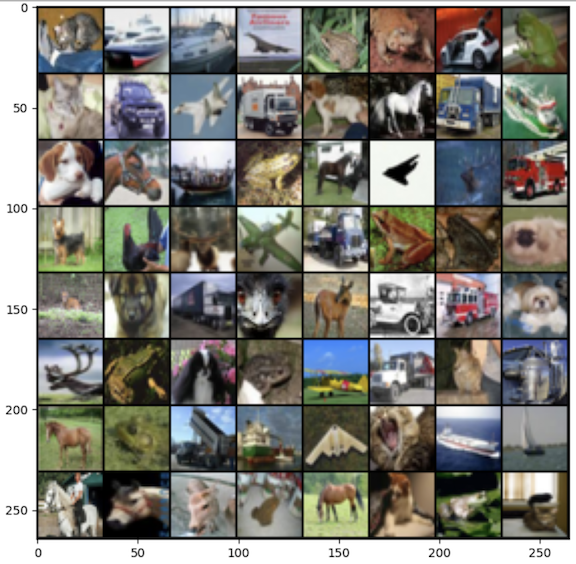
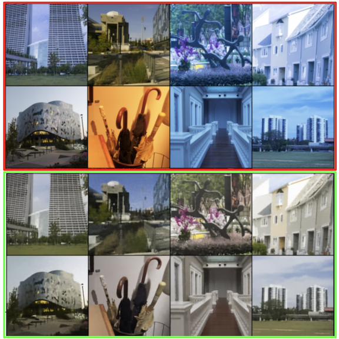
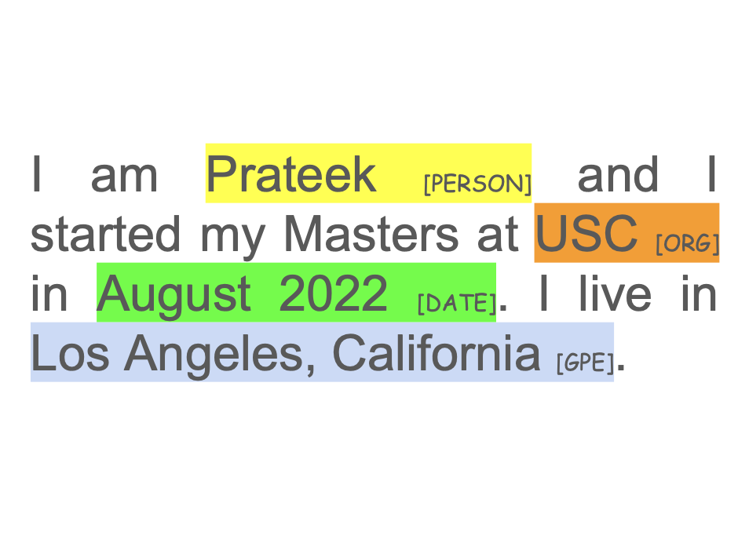

  
A collection of projects that showcase my work in AI, machine learning, and software engineering.

<table style="width: 100%; border-collapse: collapse; border: none; box-sizing: border-box;">
  
  <tr class="projects-row">
    <td style="padding: 0; vertical-align: top; border: none; width: 100%; box-sizing: border-box;">
      

        
        

          

            

              SIFRA: Super Intelligent & Friendly Responsive Agent
            

            

              
            

          

          <ul class="projects-description">
            <li>Implemented an AI agent using LangChain and RAG to seamlessly process and personalize user interactions from unstructured data.</li>
            <li>Applied generative AI methods to deliver highly adaptive, contextual, and tailored user experiences, significantly boosting engagement.</li>
          </ul>
        

      

    </td>
  </tr>

  <tr class="projects-row">
    <td style="padding: 0; vertical-align: top; border: none; width: 100%; box-sizing: border-box;">
      

        
        

          

            

              AISR: AI Sports Recap
            

            

              
            

          

          <ul class="projects-description">
            <li>Developed an AI-powered tool that generates concise summaries and engaging highlight reels from sports press conference videos, enhancing fan and media experience.</li>
            <li>Integrated advanced NLP and video analysis models, including GPT-4 and Pegasus1 (from Twelve Labs), to automate post-game recaps, interview snippets, and social media content creation.</li>
            <li>🏆 Secured second place at "Twelve Labs: Multimodal AI Media & Entertainment" Hackathon</li>
          </ul>
        

      

    </td>
  </tr>

  <tr class="projects-row">
    <td style="padding: 0; vertical-align: top; border: none; width: 100%; box-sizing: border-box;">
      

        
        

          

            

              Super Mario Brothers Gameplay using Reinforcement Learning
            

            

              
            

          

          <ul class="projects-description">
            <li>Utilized the Proximal Policy Optimization (PPO) algorithm to enhance gameplay strategies in "Super Mario Bros," leveraging the OpenAI Gym environment for robust and dynamic interaction.</li>
            <li>Employed frame extraction and grayscale conversion, integrating a history of the previous four frames with the current one for improved performance and analysis, with the agent designed to run for an extensive one million iterations.</li>
          </ul>
        

      

    </td>
  </tr>

  <tr class="projects-row">
    <td style="padding: 0; vertical-align: top; border: none; width: 100%; box-sizing: border-box;">
      

        
        

          

            

              Hidden Markov Model for Part of Speech Tagging
            

            

              
            

          

          <ul class="projects-description">
            <li>Implemented a Hidden Markov Model to perform Part of Speech (POS) tagging, leveraging the robustness of the Viterbi algorithm and greedy decoding for efficient and accurate analysis.</li>
            <li>Employed statistical methods to calculate transition and emission probabilities, ensuring a high level of precision in identifying the grammatical parts of speech in text data.</li>
          </ul>
        

      

    </td>
  </tr>

  <tr class="projects-row">
    <td style="padding: 0; vertical-align: top; border: none; width: 100%; box-sizing: border-box;">
      

        
        

          

            

              Variational Autoencoders for Digit Generation
            

            

              
            

          

          <ul class="projects-description">
            <li>Developed a comprehensive project on "Variational Autoencoders for Digit Generation," focusing on the implementation and analysis of Variational Auto-Encoders (VAEs) in machine learning. VAEs are renowned for their likelihood maximization and unsupervised representation learning capabilities.</li>
            <li>Executed key tasks including setting up a PyTorch data loading pipeline, constructing an auto-encoder architecture, extending it to a VAE, tuning parameters, analyzing representations, and enhancing generative capabilities using the MNIST dataset of handwritten digits.</li>
          </ul>
        

      

    </td>
  </tr>

  <tr class="projects-row">
    <td style="padding: 0; vertical-align: top; border: none; width: 100%; box-sizing: border-box;">
      

        
        

          

            

              Generative Adversarial Networks for Image Generation
            

            

              
            

          

          <ul class="projects-description">
            <li>Implemented a Generative Adversarial Network (GAN) based on "Unsupervised Representation Learning with Deep Convolutional Generative Adversarial Networks", utilizing the CIFAR-10 dataset for training, and developed both discriminator and generator components.</li>
            <li>Conducted a comprehensive training process with a robust loop, loss computation, and parameter updates, accompanied by activation maximization technique for visualization.</li>
            <li>Combined practical coding of advanced neural network architectures with theoretical analysis, resulting in a deepened understanding of GANs, all documented in the repository for reference.</li>
          </ul>
        

      

    </td>
  </tr>

  <tr class="projects-row">
    <td style="padding: 0; vertical-align: top; border: none; width: 100%; box-sizing: border-box;">
      

        
        

          

            

              Image White Balance Correction using Variational Autoencoders
            

            

              
            

          

          <ul class="projects-description">
            <li>Implemented a Variational Autoencoder Model for white balance correction in images, focusing on neutralizing color casts caused by different lighting conditions to achieve natural and accurate colors.</li>
            <li>Utilized the Adobe White-Balanced Images Dataset, which includes 2,881 rendered images from various camera models, including mobile phones and a DSLR camera, for testing and experiments.</li>
            <li>Developed an encoder with convolutional layers and ReLU activation, a reparameterization technique for sampling from the latent space, and a decoder with linear and transposed convolutional layers, complemented by a loss function combining reconstruction loss and Kullback-Leibler (KL) Divergence loss.</li>
          </ul>
        

      

    </td>
  </tr>

  <tr class="projects-row">
    <td style="padding: 0; vertical-align: top; border: none; width: 100%; box-sizing: border-box;">
      

        
        

          

            

              Bidirectional LSTM for Named Entity Recognition
            

            

              
            

          

          <ul class="projects-description">
            <li>Implemented a Bidirectional LSTM (BLSTM) for Named Entity Recognition (NER) using GloVe word embeddings. Initialized neural network embeddings with GloVe vectors, addressing the case-insensitivity of GloVe by adding a boolean mask for case-sensitive NER recognition.</li>
            <li>Developed model architecture with components like Embedding, LSTM, Linear, Dropout, and ELU layers, and trained using hyperparameters such as a batch size of 64, SGD optimizer, and a learning rate of 0.5 over 50 epochs, achieving an accuracy of 98.43%.</li>
          </ul>
        

      

    </td>
  </tr>

</table>

