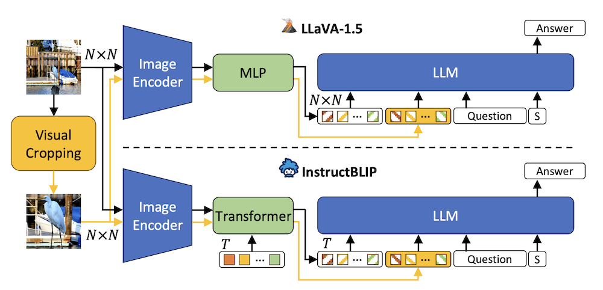
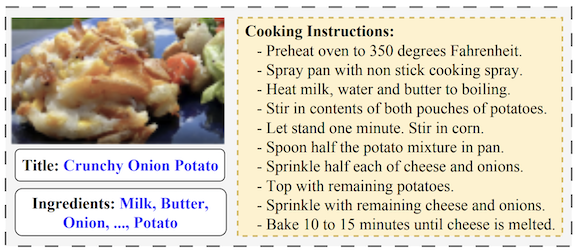
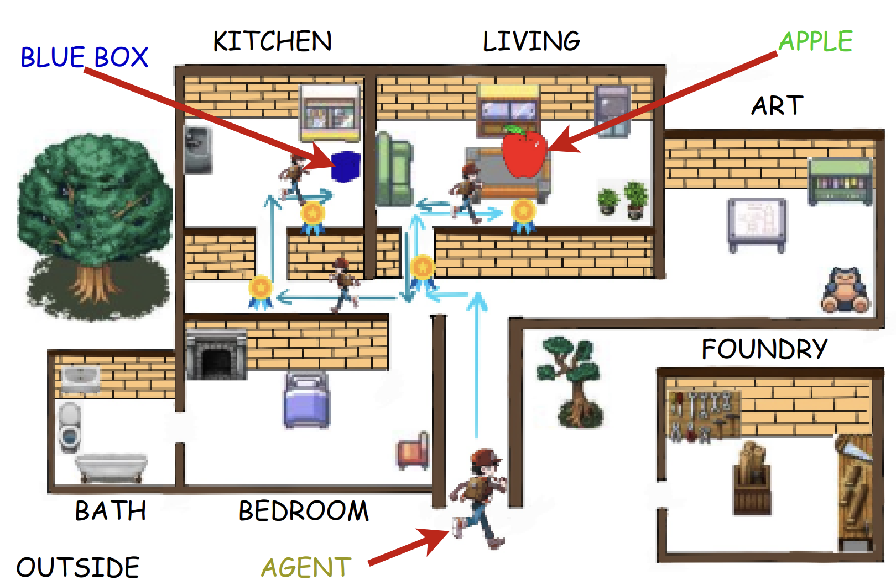
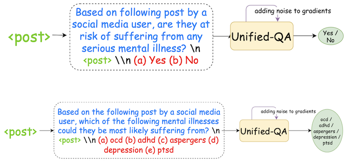
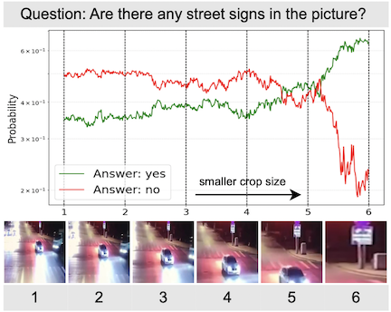
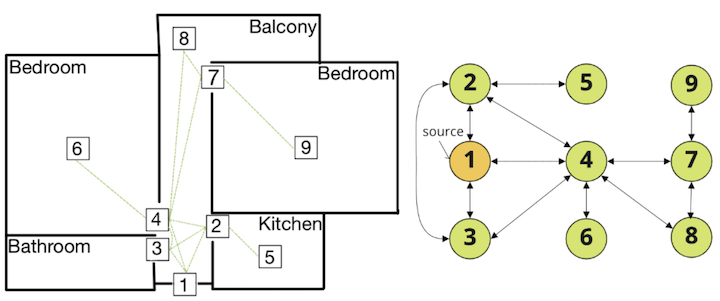
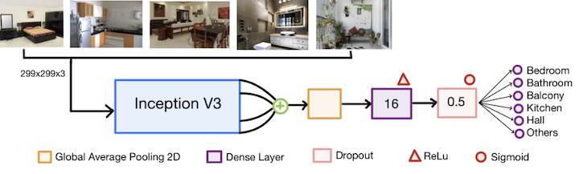

<!-- 
  <h1> <u> Pre-prints </u> </h1> 
 -->

<!-- 

  -->

## Selected Publications

<table style="width: 100%; border-collapse: separate; border-spacing: 0 15px; border: none;">

  <tr class="publication-row">
    <td style="padding: 15px; vertical-align: top; border: none;">
      
    </td>
    <td style="width: 650px; padding: 15px; vertical-align: top; border: none;">
      

        <a href="https://openreview.net/forum?id=DgaY5mDdmT" target="_blank" rel="noopener noreferrer">
          MLLMs Know Where to Look: Training-free Perception of Small Visual Details with Multimodal LLMs
        </a>
      

      
International Conference on Learning Representations (ICLR) -- 2025

      This work investigates Multimodal Large Language Models' (MLLMs) ability to perceive small versus large visual details in question answering tasks. The study shows that MLLMs' accuracy is sensitive to subject size and can be improved using visual cropping methods. These findings suggest caution and potential improvements for detail-sensitive applications. 
    </td>
  </tr>

  <tr class="publication-row">
    <td style="padding: 15px; vertical-align: top; border: none;">
      
    </td>
    <td style="width: 650px; padding: 15px; vertical-align: top; border: none;">
      

        <a href="https://openaccess.thecvf.com/content/WACV2024/html/Chhikara_FIRE_Food_Image_to_REcipe_Generation_WACV_2024_paper.html" target="_blank" rel="noopener noreferrer">
          FIRE: Food Image to REcipe generation
        </a>
      

      
IEEE/CVF Winter Conference on Applications of Computer Vision (WACV) -- 2024

      This paper introduces FIRE, a novel multimodal methodology for generating recipes from food images, contributing to the growing field of food computing. FIRE effectively produces food titles, ingredients, and cooking instructions using the BLIP model, a Vision Transformer with a decoder, and the T5 model. The paper also explores practical applications like recipe customization and recipe-to-code generation for automated cooking. 
    </td>
  </tr>

  <tr class="publication-row">
    <td style="padding: 15px; vertical-align: top; border: none;">
      
    </td>
    <td style="width: 650px; padding: 15px; vertical-align: top; border: none;">
        

            <a href="https://dl.acm.org/doi/10.1145/3587259.3627561" target="_blank" rel="noopener noreferrer">
              Knowledge-enhanced Agents for Interactive Text Games
            </a>
        

        

            

                International Conference on Knowledge Capture (KCap) -- 2023
            

            🏆🏆 Best Student Paper Award 🏆🏆 
        

      This paper introduces a knowledge-injection framework to enhance the functional grounding of agents in text-based games, addressing existing limitations in coherence, contextual awareness, and learning. It incorporates domain knowledge through memory of past actions and object affordances, aiding two types of agents: reinforcement learning and language model agents. The framework employs strategies like knowledge graphs and input encoding augmentations. Tested on 10 tasks in the ScienceWorld environment, the study reveals how task properties, model architectures, and domain knowledge interact in interactive contexts.
    </td>
  </tr>

  <tr class="publication-row">
    <td style="padding: 15px; vertical-align: top; border: none;">
      
    </td>
    <td style="width: 650px; padding: 15px; vertical-align: top; border: none;">
      

        <a href="https://aclanthology.org/2023.bionlp-1.18/" target="_blank" rel="noopener noreferrer">
          Privacy Aware Question-Answering System for Online Mental Health Risk Assessment
        </a>
      

      
ACL Workshop on Biomedical Natural Language Processing (BioNLP) -- 2023

      This paper explores using pre-trained Language Models (LMs) for assessing mental health risk from social media data. A Question-Answering (QA) approach, utilizing the Unified-QA model, is proposed for analyzing two large mental health datasets. To ensure user privacy, the model is trained with differential privacy techniques. The results show that treating risk assessment as a QA task is effective for mental health scenarios, with minimal performance loss (less than 1%) due to privacy safeguards. This approach signifies a promising direction for creating privacy-conscious diagnostic systems in mental health.
    </td>
  </tr>

  <tr class="publication-row">
    <td style="padding: 15px; vertical-align: top; border: none;">
      
    </td>
    <td style="width: 650px; padding: 15px; vertical-align: top; border: none;">
      

          <a href="https://openreview.net/forum?id=YrYcoV2dAk" target="_blank" rel="noopener noreferrer">
            Visual Cropping Improves Zero-Shot Question Answering of Multimodal Large Language Models
          </a>
      

      
NeurIPS Workshop on Robustness of Few-shot and Zero-shot Learning in Foundation Models -- 2023

      This paper examines the limitations of Multimodal Large Language Models (LLMs) in visual question answering (VQA), particularly their sensitivity to the size of visual details in images. The study finds that the zero-shot accuracy of these models decreases by up to 46% with smaller visual subjects. Human visual cropping is shown to mitigate this issue, indicating a causal relationship. The paper proposes three automatic visual cropping methods to enhance zero-shot performance in multimodal LLMs. These methods are evaluated on four VQA datasets and a VQAv2 subset focused on fine details. The results highlight the need for caution in using multimodal LLMs for detail-sensitive VQA tasks and suggest visual cropping as a viable solution for improving performance.
    </td>
  </tr>

  <tr class="publication-row">
    <td style="padding: 15px; vertical-align: top; border: none;">
      
    </td>
    <td style="width: 650px; padding: 15px; vertical-align: top; border: none;">
      

        <a href="https://dl.acm.org/doi/10.1145/3570991.3571060" target="_blank" rel="noopener noreferrer">
          DIGITOUR: Automatic Digital Tours for Real-Estate Properties
        </a>
      

      
International Conference on Data Science & Management of Data (CODS-COMAD) -- 2023

      This paper presents an automated pipeline for creating 3D virtual tours in real estate, addressing the time and cost challenges of manual annotation in traditional methods. It introduces a novel HSV-based coloring scheme for paper tags, placed in locations before capturing 360° equirectangular images. These tags are uniquely numbered and bi-colored, enhancing tag detection and digit recognition using YOLOv5 and a custom MobileNet architecture, respectively. The method links equirectangular images based on these detected tags, demonstrating its efficiency with a real-world dataset from Housing.com.
    </td>
  </tr>

  <tr class="publication-row">
    <td style="padding: 15px; vertical-align: top; border: none;">
      
    </td>
    <td style="width: 650px; padding: 15px; vertical-align: top; border: none;">
      

          <a href="https://link.springer.com/chapter/10.1007/978-3-031-26422-1_44" target="_blank" rel="noopener noreferrer">
            RE-Tagger: A light-weight Real-Estate Image Classifier
          </a>
      

      
European Conference on Machine Learning (ECML) -- 2022

      Real-estate image tagging is one of the essential use-cases to save efforts involved in manual annotation and enhance the user experience. This paper proposes an end-to-end pipeline (referred to as RE-Tagger) for the real-estate image classification problem. We present a two-stage transfer learning approach using custom InceptionV3 architecture to classify images into different categories (i.e., bedroom, bathroom, kitchen, balcony, hall, and others). 
    </td>
  </tr>

  <!-- Repeat the pattern for more papers -->
</table>

## All Publications

You can find all my publications at [Google Scholar](https://scholar.google.com/citations?user=RQTJ_aIAAAAJ&hl) or [ResearchGate](https://www.researchgate.net/profile/Prateek-Chhikara).

<h1><u>Conferences / Workshops</u></h1>

## CORE A*

  

    <a href="https://openreview.net/forum?id=DgaY5mDdmT" target="_blank" rel="noopener noreferrer">
      MLLMs Know Where to Look: Training-free Perception of Small Visual Details with Multimodal LLMs
    </a>
  

  
International Conference on Learning Representations (ICLR) -- 2025

  
J Zhang, M Khayatkhoei, <b>P Chhikara</b>, and F Ilievski

  

    
  

  

    <a href="https://openreview.net/forum?id=YrYcoV2dAk" target="_blank" rel="noopener noreferrer">
      Visual Cropping Improves Zero-Shot Question Answering of Multimodal Large Language Models
    </a>
  

  
NeurIPS Workshop on Robustness of Few-shot and Zero-shot Learning in Foundation Models -- 2023

  
J Zhang, M Khayatkhoei, <b>P Chhikara</b>, and F Ilievski

  

    
    
  

  

    <a href="https://aclanthology.org/2023.bionlp-1.18/" target="_blank" rel="noopener noreferrer">
      Privacy Aware Question-Answering System for Online Mental Health Risk Assessment
    </a>
  

  
ACL Proceedings of the 22nd Workshop on Biomedical Language Processing -- 2023

  
<b>P Chhikara</b>, U Pasupulety, J Marshall, D Chaurasia, and S Kumari

  

    
    
    
  

  

    <a href="https://dl.acm.org/doi/abs/10.1145/3477090.3481051" target="_blank" rel="noopener noreferrer">
      Federated Learning-based Aerial Image Segmentation for collision-free Movement and Landing
    </a>
  

  
Proceedings of the 4th ACM MobiCom Workshops -- 2021

  
<b>P Chhikara</b>, R Tekchandani, N Kumar, and S Tanwar

  

    
  

## CORE A

  

    <a href="https://openaccess.thecvf.com/content/WACV2024/html/Chhikara_FIRE_Food_Image_to_REcipe_Generation_WACV_2024_paper.html" target="_blank" rel="noopener noreferrer">
      FIRE: Food Image to REcipe generation
    </a>
  

  
IEEE/CVF Winter Conference on Applications of Computer Vision (WACV) -- 2024

  
<b>P Chhikara</b>, D Chaurasia, Y Jiang, O Masur, and F Ilievski

  

    
    
    
  

  

    <a href="https://link.springer.com/chapter/10.1007/978-3-031-26422-1_44" target="_blank" rel="noopener noreferrer">
      RE-Tagger: A light-weight Real-Estate Image Classifier
    </a>
  

  
European Conference on Machine Learning and Principles and Practice of Knowledge Discovery in Databases (ECML-PKDD) -- 2022

  
<b>P Chhikara</b>, A Goyal, and C Sharma

  

    
    
  

## CORE B

  

    <a href="https://dl.acm.org/doi/10.1145/3587259.3627561" target="_blank" rel="noopener noreferrer">
      Knowledge-enhanced Agents for Interactive Text Games
    </a>
  

  
International Conference on Knowledge Capture (KCap) -- 2023

  
<b>P Chhikara</b>, J Zhang, F Ilievski, J Francis, and K Ma

  

    🏆🏆 Best Student Paper Award 🏆🏆
    
    
  

  

    <a href="https://dl.acm.org/doi/10.1145/3570991.3571060" target="_blank" rel="noopener noreferrer">
      DIGITOUR: Automatic Digital Tours for Real-Estate Properties
    </a>
  

  
ACM CODS-COMAD -- 2023

  
<b>P Chhikara</b>, H Kuhar, A Goyal, and C Sharma

  

    
  

  

    <a href="https://ieeexplore.ieee.org/abstract/document/9685991" target="_blank" rel="noopener noreferrer">
      Federated Learning for Air Quality Index Prediction using UAV Swarm Networks
    </a>
  

  
IEEE Global Communications Conference (GLOBECOM) -- 2021

  
<b>P Chhikara</b>, R Tekchandani, N Kumar, S Tanwar, and JJPC Rodrigues

  

    
  

  

    <a href="https://ieeexplore.ieee.org/abstract/document/9024537" target="_blank" rel="noopener noreferrer">
      An efficient scheme for wireless charging of electric vehicles using RFID with an optimal path planning
    </a>
  

  
IEEE Globecom Workshops (GC Wkshps) -- 2019

  
S Arora, S Goel, <b>P Chhikara</b>, H Singh, N Kumar, and PS Rana

  

    
  

## Unranked

  

    <a href="https://ieeexplore.ieee.org/abstract/document/9077805" target="_blank" rel="noopener noreferrer">
      An ensemble approach for extractive text summarization
    </a>
  

  
International Conference on Emerging Trends in Information Technology and Engineering -- 2020

  
P Singh, <b>P Chhikara</b>, and J Singh

  

    
  

 

<h1><u>Journals</u></h1>

## Quartile 1 (Q1)

  

    <a href="https://ieeexplore.ieee.org/abstract/document/10509607" target="_blank" rel="noopener noreferrer">
      A Differentially Privacy Assisted Federated Learning Scheme to Preserve Data Privacy for IoMT Applications
    </a>
  

  
IEEE Transactions on Network and Service Management -- 2024

  
A Barnawi, <b>P Chhikara</b>, R Tekchandani, N Kumar, and B Alzahrani

  

    
  

  

    <a href="https://www.sciencedirect.com/science/article/pii/S1047320323002717" target="_blank" rel="noopener noreferrer">
      Sea-Pix-GAN: Underwater image enhancement using adversarial neural network
    </a>
  

  
Journal of Visual Communication and Image Representation -- 2024

  
D Chaurasia and <b>P Chhikara</b>

  

    
  

  

    <a href="https://ieeexplore.ieee.org/abstract/document/9409140" target="_blank" rel="noopener noreferrer">
      Federated learning and autonomous UAVs for hazardous zone detection and AQI prediction in IoT environment
    </a>
  

  
IEEE Internet of Things Journal -- 2021

  
<b>P Chhikara</b>, R Tekchandani, N Kumar, M Guizani, and MM Hassan

  

    
  

  

    <a href="https://www.sciencedirect.com/science/article/pii/S0167739X21001692" target="_blank" rel="noopener noreferrer">
      Artificial intelligence-enabled Internet of Things-based system for COVID-19 screening using aerial thermal imaging
    </a>
  

  
Future Generation Computer Systems -- 2021

  
A Barnawi, <b>P Chhikara</b>, R Tekchandani, N Kumar, and B Alzahrani

  

    
  

  

    <a href="https://ieeexplore.ieee.org/abstract/document/9207753" target="_blank" rel="noopener noreferrer">
      DCNN-GA: A Deep Neural Net Architecture for Navigation of UAV in Indoor Environment
    </a>
  

  
IEEE Internet of Things Journal -- 2020

  
<b>P Chhikara</b>, R Tekchandani, N Kumar, V Chamola, and M Guizani

  

    
  

  

    <a href="https://ieeexplore.ieee.org/abstract/document/9253631" target="_blank" rel="noopener noreferrer">
      Federated Learning meets Human Emotions: a Decentralized Framework for Human-Computer Interaction for IoT Applications
    </a>
  

  
IEEE Internet of Things Journal -- 2020

  
<b>P Chhikara</b>, P Singh, R Tekchandani, N Kumar, and M Guizani

  

    
  

  

    <a href="https://ieeexplore.ieee.org/abstract/document/9253547" target="_blank" rel="noopener noreferrer">
      An Efficient Container Management Scheme for Resource Constrained Intelligent IoT Devices
    </a>
  

  
IEEE Internet of Things Journal -- 2020

  
<b>P Chhikara</b>, R Tekchandani, N Kumar, and MS Obaidat

  

    
  

## Quartile 2 (Q2)

  

    <a href="https://link.springer.com/article/10.1007/s00607-022-01146-6" target="_blank" rel="noopener noreferrer">
      Adaptive federated learning scheme for recognition of malicious attacks in an IoT network
    </a>
  

  
Computing -- 2023

  
<b>P Chhikara</b>, R Tekchandani, and N Kumar

  

    
  

  

    <a href="https://link.springer.com/article/10.1007/s00530-021-00833-2" target="_blank" rel="noopener noreferrer">
      A CNN-based scheme for COVID-19 detection with emergency services provisions using an optimal path planning
    </a>
  

  
Multimedia Systems -- 2021

  
A Barnawi, <b>P Chhikara</b>, R Tekchandani, N Kumar, and M Boulares

  

    
  

  

    <a href="https://onlinelibrary.wiley.com/doi/abs/10.1002/spe.2876" target="_blank" rel="noopener noreferrer">
      Data dimensionality reduction techniques for Industry 4.0: Research results, challenges, and future research directions
    </a>
  

  
Software: Practice and Experience -- 2020

  
<b>P Chhikara</b>, N Jain, R Tekchandani, and N Kumar

  

    
  

## Quartile 3 (Q3)

  

    <a href="https://journals.tubitak.gov.tr/elektrik/vol29/iss8/6/" target="_blank" rel="noopener noreferrer">
      A Deep Transfer Learning based model for Automatic Detection of COVID-19 from Chest X-Rays
    </a>
  

  
Turkish Journal of Electrical Engineering and Computer Sciences -- 2021

  
<b>P Chhikara</b>, P Gupta, P Singh, and T Bhatia

  

    
  

 

<h1><u>Book Chapter</u></h1>

  

    <a href="https://link.springer.com/chapter/10.1007/978-981-15-0339-9_13" target="_blank" rel="noopener noreferrer">
      Deep convolutional neural network with transfer learning for detecting pneumonia on chest X-rays
    </a>
  

  
Advances in Bioinformatics, Multimedia, and Electronics Circuits and Signals -- 2019

  
<b>P Chhikara</b>, P Singh, P Gupta, and T Bhatia

  

    
  

